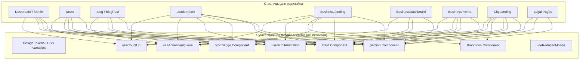
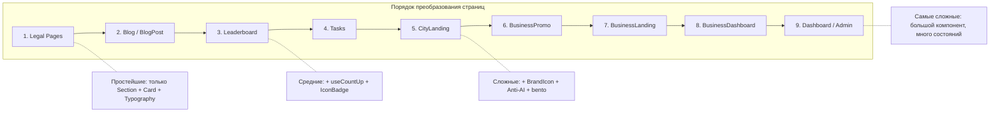

# Design Document: Full Site Redesign

## Overview

Расширение дизайн-системы, реализованной в premium-redesign, на все оставшиеся страницы NOXISS.WORK. Работа носит исключительно визуальный характер: оборачивание контента в существующие компоненты (Section, Card, IconBadge, BrandIcon), замена хардкодированных стилей на CSS-токены, добавление scroll-анимаций и обеспечение тёмной темы. Бизнес-логика, Supabase-вызовы и роутинг остаются нетронутыми.

**Ключевые принципы:**
- Только визуальные изменения — никаких изменений в бизнес-логике, стейте или API-вызовах
- Использование исключительно существующих компонентов и хуков дизайн-системы
- Последовательное преобразование каждой страницы как атомарная единица работы
- Визуальная регрессия как основной метод тестирования корректности



## Architecture

### Подход к преобразованию

Каждая страница преобразуется по единому алгоритму:

1. **Token Replacement** — замена всех `bg-[#hex]`, `text-[#hex]`, `border-[#hex]` на соответствующие CSS-токены (`bg-surface-primary`, `text-text-primary`, `border-border-primary`)
2. **Section Wrapping** — разбиение контента на логические секции и обёртка каждой в `<Section variant="...">` с подходящими `decorElements`
3. **Card Wrapping** — замена `<div>` с ручными стилями карточек на `<Card variant="..." accent="...">` с правильным типом
4. **Animation Integration** — подключение `useScrollAnimation` к секциям, `useAnimationQueue` к группам карточек, `useCountUp` к числовым значениям
5. **Anti-AI Cleanup** — устранение gradient-text, замена одинаковых grid на bento-layout
6. **Responsive Audit** — проверка breakpoints, замена hover на tap-feedback для touch

### Стратегия чередования вариантов Section

Для обеспечения контраста между смежными секциями (минимум ΔL=10 в HSL):

```
light (#F8F9FA, L≈98) → dark (#0F1117, L≈7) → accent (#EEF4FF, L≈96) → textured (#F8F9FA + pattern)
```

Правила:
- Никогда не ставить `light` рядом с `accent` (ΔL=2, недостаточно)
- Допустимые пары: light↔dark, dark↔accent, accent↔dark, light↔textured
- Hero-секции всегда `dark` или `accent`
- CTA-блоки всегда `accent`
- FAQ и юридические тексты — `light` с минимальным декором

### Стратегия назначения вариантов Card

| Тип контента | Card variant | Accent | Обоснование |
|---|---|---|---|
| Баланс, статистика | `flat` | — | Нейтральный фон, без отвлечения |
| Задания, заказы | `elevated` | `line` | Визуальная глубина, акцентная линия как индикатор категории |
| Шаги, преимущества | `bordered` | `corner` | Чёткие границы для структурированного контента |
| Отзывы, цитаты | `glass` | — | Прозрачность для фоновых элементов |
| Статьи блога | `elevated` | `pattern` | Визуальная глубина + паттерн для текстового контента |
| Формы | `bordered` | — | Чёткие границы для полей ввода |
| Топ-3 лидерборда | `glass` | — | Премиальный вид для выделения |

### Стратегия декоративных элементов

| Тип секции | decorElements types | Количество |
|---|---|---|
| Статистика / числа | `dots`, `grid` | 3-4 |
| Шаги / how-it-works | `geometric`, `lines` | 3 |
| CTA / призыв | `blob`, `geometric` | 2-3 |
| FAQ / юридика | `dots`, `lines` | 2 |
| Hero / заголовок | `blob`, `geometric`, `dots` | 4-5 |
| Лидерборд | `geometric`, `dots` | 3 |



## Components and Interfaces

### Используемые компоненты (без изменений)

Все компоненты уже реализованы в рамках premium-redesign. Новый код не создаётся — только используются существующие интерфейсы:

#### Section Component (`components/ui/Section.tsx`)

```typescript
interface SectionProps {
  variant: 'light' | 'dark' | 'accent' | 'textured';
  children: React.ReactNode;
  className?: string;
  decorElements?: DecorativeElement[];
  id?: string;
}

interface DecorativeElement {
  type: 'blob' | 'grid' | 'dots' | 'lines' | 'geometric';
  position: { top?: string; left?: string; right?: string; bottom?: string };
  opacity: number; // 0.03–0.15
  size: string;
  className?: string;
}
```

#### Card Component (`components/ui/Card.tsx`)

```typescript
interface CardProps {
  variant: 'flat' | 'elevated' | 'bordered' | 'glass';
  children: React.ReactNode;
  className?: string;
  accent?: 'line' | 'corner' | 'pattern';
  accentColor?: string;
  hoverable?: boolean;
}
```

#### IconBadge Component (`components/ui/IconBadge.tsx`)

```typescript
interface IconBadgeProps {
  icon: LucideIcon;
  color: string;           // Tailwind color class
  size?: 'sm' | 'md' | 'lg';
  animation?: 'pulse' | 'rotate' | 'bounce' | 'none';
  className?: string;
}
```

#### BrandIcon Component (`components/ui/BrandIcon.tsx`)

```typescript
interface BrandIconProps {
  brand: 'avito' | 'yandex' | '2gis' | 'google';
  size?: number;           // 24-32px
  withLabel?: boolean;
  className?: string;
}
```

### Хуки анимаций (без изменений)

#### useScrollAnimation (`hooks/useScrollAnimation.ts`)

```typescript
interface ScrollAnimationConfig {
  threshold?: number;      // default: 0.2
  duration?: number;       // default: 500ms
  delay?: number;          // default: 0
  staggerDelay?: number;   // default: 75ms
  translateY?: number;     // default: 24px
  easing?: string;         // default: cubic-bezier(0.16, 1, 0.3, 1)
  once?: boolean;          // default: true
}
// Returns: { ref, style, isInView }
```

#### useAnimationQueue (`hooks/useAnimationQueue.ts`)

```typescript
// Returns: { enqueue, isActive, activeCount }
// Mobile (<768px): max 3 concurrent animations
// Desktop: unlimited
```

#### useCountUp (`hooks/useCountUp.ts`)

```typescript
interface CountUpConfig {
  end: number;
  duration?: number;       // default 1000ms
  easing?: 'easeOut' | 'easeInOut';
  startOnView?: boolean;   // default true
  threshold?: number;      // default 0.5
}
// Returns: { ref, value, isComplete }
```

### Паттерн интеграции в страницу

Типовой шаблон преобразования любой страницы:

```tsx
import { Section } from '../ui/Section';
import { Card } from '../ui/Card';
import { IconBadge } from '../ui/IconBadge';
import { useScrollAnimation } from '../../hooks/useScrollAnimation';
import { useCountUp } from '../../hooks/useCountUp';

function PageComponent() {
  const heroAnim = useScrollAnimation({ threshold: 0.1 });
  const contentAnim = useScrollAnimation({ delay: 100 });
  
  return (
    <div className="min-h-screen bg-surface-primary">
      <Section variant="dark" decorElements={[...]}>
        <div ref={heroAnim.ref as any} style={heroAnim.style}>
          {/* Hero content */}
        </div>
      </Section>
      
      <Section variant="light" decorElements={[...]}>
        <div ref={contentAnim.ref as any} style={contentAnim.style}>
          <Card variant="elevated" accent="line">
            {/* Card content */}
          </Card>
        </div>
      </Section>
    </div>
  );
}
```

### Маппинг цветов: хардкод → токен

| Hardcoded | Token (Tailwind class) | Применение |
|---|---|---|
| `bg-[#F5F5F7]`, `bg-white` | `bg-surface-primary` | Фон страниц и секций |
| `bg-[#1c1c1e]`, `bg-black` | `bg-surface-dark` | Тёмные секции |
| `bg-white/50`, `bg-black/50` | `bg-surface-secondary/50` | Полупрозрачные фоны |
| `text-[#1d1d1f]` | `text-text-primary` | Основной текст |
| `text-slate-500`, `text-slate-700` | `text-text-secondary` | Вспомогательный текст |
| `text-slate-400` | `text-text-muted` | Приглушённый текст |
| `text-[#0071e3]`, `text-blue-600` | `text-accent-primary` | Акцентные ссылки/кнопки |
| `bg-[#0071e3]` | `bg-accent-primary` | Акцентные кнопки |
| `border-slate-100`, `border-slate-200` | `border-border-primary` | Границы (light theme) |
| `border-white/10`, `border-white/5` | `border-border-secondary` | Границы (dark theme) |

### Преобразование по страницам

#### Legal Pages (Terms, Privacy, Offer)

Минимальное преобразование — обёртка в Section + Card + Typography:

```tsx
<Section variant="light" decorElements={[
  { type: 'dots', position: { top: '5%', right: '3%' }, opacity: 0.04, size: '100px' },
  { type: 'lines', position: { bottom: '10%', left: '2%' }, opacity: 0.03, size: '80px' },
]}>
  <Card variant="elevated" className="max-w-[800px] mx-auto">
    <h1 className="typo-h1 text-text-primary mb-8">...</h1>
    <div className="typo-body text-text-secondary space-y-4">...</div>
  </Card>
</Section>
```

#### Blog Page

Bento-grid: первая статья `col-span-2`, остальные `col-span-1`:

```tsx
<Section variant="light" decorElements={[...]}>
  <div className="grid md:grid-cols-2 lg:grid-cols-3 gap-6">
    {posts.map((post, i) => (
      <Card 
        variant="elevated" 
        accent="pattern"
        className={i === 0 ? 'md:col-span-2' : ''}
      >
        {/* Post card content */}
      </Card>
    ))}
  </div>
</Section>
```

#### Leaderboard

Dark Section + glass Cards для топ-3 + flat для остальных:

```tsx
<Section variant="dark" decorElements={[
  { type: 'geometric', position: { top: '10%', left: '5%' }, opacity: 0.06, size: '120px' },
  { type: 'dots', position: { bottom: '15%', right: '5%' }, opacity: 0.05, size: '100px' },
  { type: 'geometric', position: { top: '60%', right: '10%' }, opacity: 0.04, size: '80px' },
]}>
  {/* Top 3: Card variant="glass" + IconBadge for medals */}
  {/* Rest: Card variant="flat" with Stagger */}
</Section>
```

#### Tasks Page

Category filter + elevated cards with color-coded accent lines:

```tsx
const CATEGORY_COLORS: Record<string, string> = {
  'Отзывы': 'var(--accent-primary)',    // синий
  'Авито': '#f97316',                    // оранжевый
  'Соцсети': '#06b6d4',                  // голубой
  'Приложения': '#22c55e',               // зелёный
};
```

#### CityLanding

Hero dark + BrandIcon + bordered benefits + accent CTA:

```tsx
<Section variant="dark" decorElements={[blobs, geometric]}>
  <BrandIcon brand={platform} size={32} withLabel />
  <h1 className="typo-h1 text-accent-primary">...</h1> {/* вместо gradient text */}
</Section>
<Section variant="light">
  {benefits.map(b => <Card variant="bordered"><IconBadge ... /></Card>)}
</Section>
<Section variant="accent">
  <Card variant="glass">{/* CTA */}</Card>
</Section>
```

#### Dashboard / Admin

Самый сложный компонент (~1000+ строк). Стратегия:
- НЕ разбивать на отдельные файлы (сохраняем структуру)
- Оборачиваем основные блоки в Section/Card внутри существующего JSX
- Добавляем useCountUp к балансу
- Добавляем useScrollAnimation к блокам

## Data Models

Данные не изменяются. Все модели Supabase, структуры стейта и формат API-ответов остаются прежними. Изменяется только визуальное представление данных через компоненты дизайн-системы.

### Существующие модели (не меняются)

- **Tasks**: `{ id, title, description, category, reward, remaining_count, platform, ... }`
- **Profiles**: `{ id, email, role, balance, completed_tasks, invited_by, ... }`
- **Task Submissions**: `{ id, task_id, user_id, status, created_at, ... }`
- **Blog Posts**: статический массив `BLOG_POSTS` в `Blog.tsx`
- **City/Platform data**: статические объекты `CITIES`, `PLATFORMS` в `CityLanding.tsx`
- **Leaderboard**: динамическая загрузка из Supabase (profiles + task_submissions)

### CSS-переменные (уже определены в index.css)

```css
:root {
  --surface-primary: #F8F9FA;
  --surface-secondary: #FFFFFF;
  --surface-accent: #EEF4FF;
  --surface-dark: #0F1117;
  --text-primary: #1A1A2E;
  --text-secondary: #4A4A6A;
  --text-muted: #6E6E80;
  --accent-primary: #006BDB;
  --accent-secondary: #5856D6;
}

.dark {
  --surface-primary: #0A0A0F;
  --surface-secondary: #12121A;
  --surface-accent: #1A1A2E;
  --surface-dark: #060608;
  --text-primary: #F0F0F5;
  --text-secondary: #A0A0B0;
  --text-muted: #9494A4;
}
```

## Error Handling

### Стратегия безопасности при редизайне

1. **Принцип неинвазивности**: изменения ограничены JSX-разметкой и CSS-классами. Обработчики событий (`onClick`, `onSubmit`, `onChange`), вызовы `supabase`, хуки состояния (`useState`, `useEffect`) не модифицируются.

2. **Fallback при ошибках рендеринга**: если после обёртки в Section/Card компонент перестаёт рендериться (TypeError, missing prop), откатить к минимальной стилизации:
   - Убрать Section/Card обёртки
   - Применить только замену цветов на токены
   - Добавить `className` с typography-классами

3. **Сохранение ref-ов**: при добавлении `useScrollAnimation` новые `ref` не должны перезаписывать существующие. Использовать wrapper `<div>` вокруг элементов с существующими ref.

4. **Animation safety**: все хуки анимаций уже интегрируют `useReducedMotion` — дополнительная обработка не требуется.

5. **Порядок работы** (минимизация риска):
   - Начинать с простых страниц (Legal) — валидировать паттерн
   - Заканчивать сложными (Dashboard) — после отработки подхода
   - Проверять каждую страницу после преобразования в браузере

### Потенциальные проблемы и решения

| Проблема | Решение |
|---|---|
| Section добавляет лишние padding к Dashboard | Использовать `className="py-8"` для переопределения |
| Card ломает flex-layout внутренних элементов | Добавить `className="flex flex-col"` к Card |
| useScrollAnimation конфликтует с существующим IntersectionObserver | Обернуть в дополнительный div вместо замены ref |
| Gradient text используется как часть логики (conditional) | Заменить только визуальные классы, сохранить условия |
| Тёмная тема не переключает inline-стили | Заменить inline `style={{color: '#hex'}}` на className с токеном |
| bento-grid ломает мобильный layout | Использовать `grid-cols-1 md:grid-cols-2 lg:grid-cols-3` с col-span только на lg+ |

## Correctness Properties

Данный feature — чисто визуальное преобразование без бизнес-логики, поэтому классические property-based tests с генерацией входных данных не применимы. Вместо этого определяются инвариантные свойства, проверяемые статическим анализом и сборкой:

### Property 1: Build integrity
После каждого преобразования страницы проект собирается без ошибок TypeScript (`npm run build` завершается с exit code 0). Ни одна страница не должна вызывать ошибки компиляции после обёртки в Section/Card компоненты.

**Validates: Requirements 15.1**

### Property 2: No hardcoded colors
Ни один файл преобразованных страниц не содержит хардкодированных цветовых паттернов (`bg-[#`, `text-[#`, `border-[#`, `bg-white`, `bg-black`, `text-white` без контекста dark-темы). Все цвета используют CSS-токены дизайн-системы.

**Validates: Requirements 3.1, 3.2, 3.3, 3.4**

### Property 3: Event handler preservation
Количество обработчиков событий (`onClick`, `onSubmit`, `onChange`, `onKeyDown`) в каждом файле не уменьшается после преобразования. Бизнес-логика остаётся нетронутой.

**Validates: Requirements 15.2, 15.3**

### Property 4: Component usage consistency
Каждая преобразованная страница импортирует и рендерит минимум один `Section` компонент. Страницы с карточным контентом используют минимум один `Card` компонент.

**Validates: Requirements 1.1, 2.1**

### Property 5: Dark theme readiness
Ни один преобразованный файл не содержит inline-стилей с хардкодированными цветами (`style={{color: '#hex'}}` или `style={{background: '#hex'}}`), которые не переключаются в тёмной теме.

**Validates: Requirements 6.5**

### Property 6: Responsive layout safety
Ни одна преобразованная страница не содержит фиксированных ширин (`w-[Npx]` где N > 400) без responsive-обёртки, гарантируя отсутствие горизонтального скролла на мобильных устройствах.

**Validates: Requirements 16.1**

## Testing Strategy

### Подход к тестированию

Поскольку данный feature представляет собой чисто визуальное преобразование (UI rendering, layout, CSS styling) без бизнес-логики, property-based testing **не применим**. Вместо этого используется комбинация:

1. **Визуальная регрессия (ручная)** — сравнение внешнего вида до и после на ключевых breakpoints
2. **Smoke-тесты функциональности** — проверка что кнопки, формы и навигация продолжают работать
3. **Accessibility audit** — проверка контрастности WCAG AA/AAA в обоих темах

### Почему PBT не подходит

- Изменения затрагивают только визуальный слой (CSS-классы, обёртки компонентов)
- Нет чистых функций с input/output для тестирования свойств
- Корректность определяется визуальным результатом, а не вычислимым свойством
- Нет универсальных свойств типа "для всех входов X, результат Y"

### План тестирования

#### 1. Breakpoint Audit (для каждой страницы)

| Breakpoint | Проверка |
|---|---|
| 320px | Нет horizontal scroll, single-column layout, padding 16px |
| 768px | Grid переключается на 2 колонки где допустимо |
| 1024px | Typography масштабируется до desktop-размеров |
| 1440px | max-width 7xl центрирован, нет растяжки |

#### 2. Dark Theme Verification (для каждой страницы)

- [ ] Все фоны используют CSS-токены (нет `bg-white`, `bg-[#hex]`)
- [ ] Все тексты читаемы (контраст ≥4.5:1 для body, ≥7:1 для основного)
- [ ] Тени заменены на свечения (glow)
- [ ] Нет "белых пятен" или инвертированных элементов

#### 3. Functionality Smoke Tests (для каждой страницы)

- [ ] Dashboard: вход, просмотр баланса, форма вывода, история
- [ ] Tasks: фильтрация по категориям, взятие задания
- [ ] Blog: переход на статью, навигация назад
- [ ] Leaderboard: загрузка данных, отображение
- [ ] CityLanding: отображение по route-параметрам
- [ ] BusinessDashboard: форма заказа, баланс
- [ ] Legal: скролл, навигация

#### 4. Animation Verification

- [ ] Scroll-анимации срабатывают при появлении в viewport
- [ ] Stagger-анимации имеют последовательную задержку
- [ ] useCountUp анимирует числа при появлении
- [ ] `prefers-reduced-motion: reduce` отключает все анимации движения
- [ ] На мобильных (< 768px) не более 3 одновременных анимаций
- [ ] Hover заменён на tap-feedback на touch-устройствах

#### 5. Anti-AI Pattern Verification

- [ ] Нет `bg-clip-text bg-gradient-to-r` (gradient text)
- [ ] Нет одинаковых grid-cols-3/4 с полностью симметричными карточками
- [ ] Есть bento-grid (col-span-2) минимум на 1 секции каждой страницы с 4+ элементами
- [ ] Hero-секции используют decorElements вместо radial-gradient
