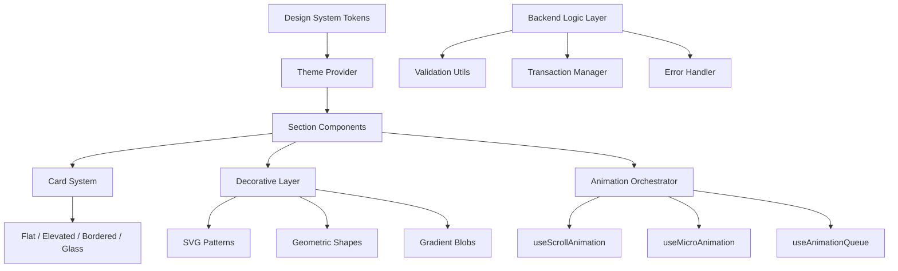
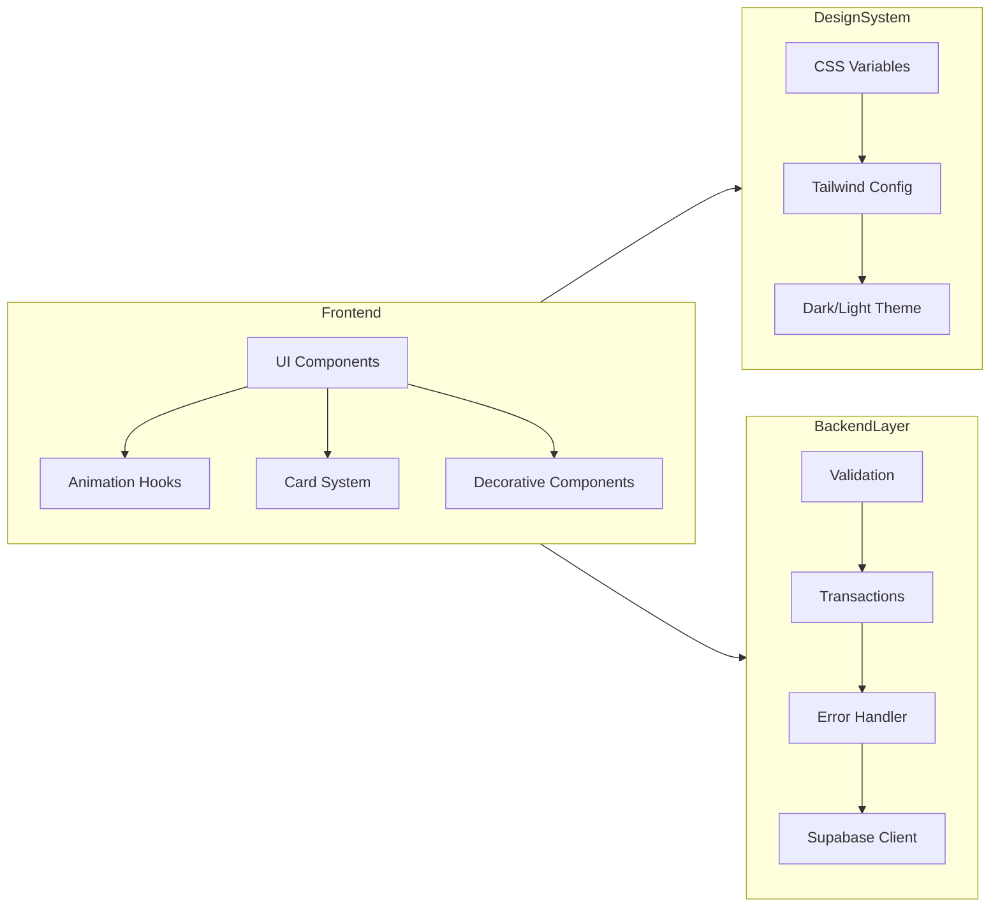
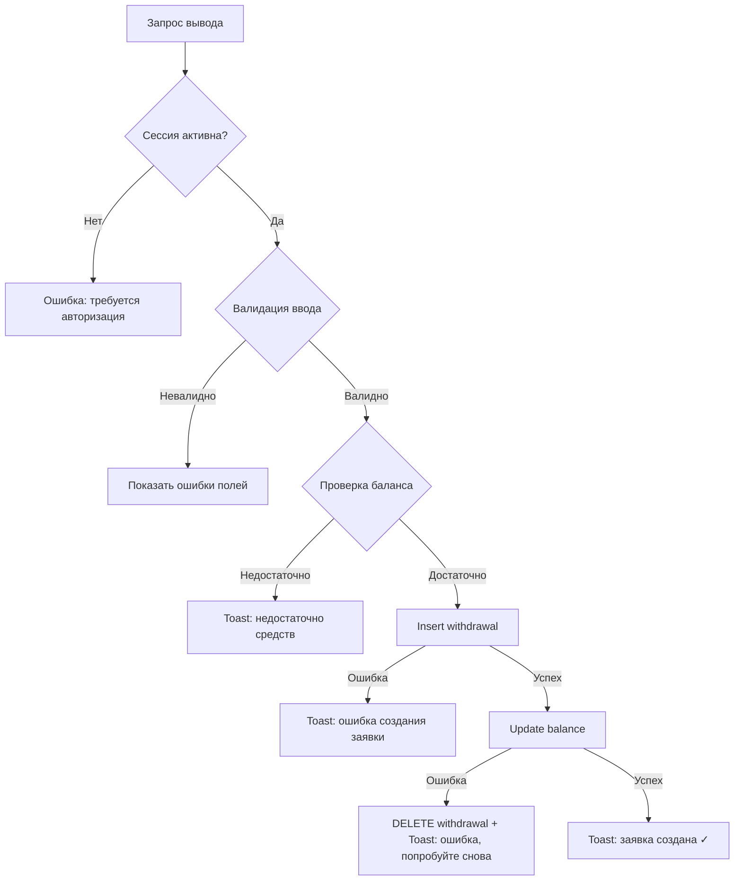

# Design Document: Premium Redesign

## Overview

Премиум-редизайн NOXISS.WORK трансформирует существующий сайт из шаблонного AI-стиля в максималистичный, студийного качества интерфейс. Архитектура решения построена на расширении существующего стека (React 18, Tailwind CSS 3.4, Framer Motion 12) без внедрения новых зависимостей.

Ключевые архитектурные решения:
- **Дизайн-система как слой абстракции**: CSS-переменные + Tailwind-токены для единообразия и переключения тем
- **Компонентный подход к декору**: декоративные элементы — отдельные lazy-загружаемые компоненты
- **Анимации через единый оркестратор**: централизованный хук `useScrollAnimation` на базе IntersectionObserver + Framer Motion
- **Backend-аудит как отдельный модуль**: утилиты валидации и транзакционные обёртки вокруг Supabase-вызовов



## Architecture

### Слой 1: Design System Tokens

Все визуальные параметры определяются через CSS-переменные в `:root` и `.dark`, управляемые через `tailwind.config.js`. Это обеспечивает единый источник правды для цветов, теней, радиусов и типографики.

### Слой 2: Theme Provider

Расширение существующего `isDarkMode` стейта в `App.tsx` с добавлением CSS-переменных и transition на `<html>`. Использует `prefers-color-scheme` + `localStorage` для персистентности.

### Слой 3: Section Components

Каждая секция главной страницы (`Hero`, `HowItWorks`, `Stats`, `Trust`, `FAQ`, `Footer`) оборачивается в компонент `<Section variant="light|dark|accent|textured">`, который автоматически применяет многослойный фон, декор и правильные отступы.

### Слой 4: Animation Orchestrator

Централизованная система, управляющая:
- Scroll-анимациями через `useInView` (react-intersection-observer) + Framer Motion `motion`
- Очередью анимаций на мобильных (макс. 3 одновременных)
- Staggered-появлением групп элементов
- Автоотключением при `prefers-reduced-motion`

### Слой 5: Backend Logic Layer

Обёртки над `supabase` клиентом для:
- Валидации входных данных перед отправкой
- Транзакционной логики (withdraw + balance update)
- Единообразной обработки ошибок



## Components and Interfaces

### 1. Design Token System

**Файл:** `tailwind.config.js` (расширение) + `index.css` (CSS-переменные)

```typescript
// Расширенная конфигурация Tailwind
interface DesignTokens {
  colors: {
    surface: { light: string[]; dark: string[] };     // Фоны секций
    accent: { primary: string; secondary: string };    // Акценты
    text: { primary: string; secondary: string; muted: string };
    glow: { blue: string; purple: string; green: string };
  };
  shadows: {
    card: string;         // Двойная тень для карточек
    cardHover: string;    // Усиленная тень при hover
    glow: string;         // Цветное свечение (dark mode)
  };
  radii: {
    container: string;    // 24px
    card: string;         // 20px
    button: string;       // 12px
    badge: string;        // 8px
  };
  typography: {
    scale: Record<'h1' | 'h2' | 'h3' | 'h4' | 'body' | 'small' | 'caption', {
      size: string;
      sizeMobile: string;
      weight: number;
      lineHeight: number;
      letterSpacing: string;
    }>;
  };
}
```

### 2. Section Wrapper Component

**Файл:** `components/ui/Section.tsx`

```typescript
interface SectionProps {
  variant: 'light' | 'dark' | 'accent' | 'textured';
  children: React.ReactNode;
  className?: string;
  decorElements?: DecorativeElement[];
  id?: string;
}

interface DecorativeElement {
  type: 'blob' | 'grid' | 'dots' | 'lines' | 'geometric';
  position: { top?: string; left?: string; right?: string; bottom?: string };
  opacity: number;  // 0.03–0.15
  size: string;
  className?: string;
}
```

Компонент автоматически:
- Подставляет 3-слойный фон (solid + texture + SVG decor)
- Ограничивает декор 2–6 элементами
- Проверяет что декор не перекрывает interactive/text content (через `pointer-events-none` и `z-index`)
- Lazy-загружает SVG-декор через `React.lazy` + `Suspense`

### 3. Card Component System

**Файл:** `components/ui/Card.tsx`

```typescript
type CardVariant = 'flat' | 'elevated' | 'bordered' | 'glass';

interface CardProps {
  variant: CardVariant;
  children: React.ReactNode;
  className?: string;
  accent?: 'line' | 'corner' | 'pattern';  // Декоративный элемент
  accentColor?: string;
  hoverable?: boolean;
}

// Маппинг контента на вариант
const CONTENT_VARIANT_MAP: Record<string, CardVariant> = {
  pricing: 'elevated',
  benefit: 'bordered',
  step: 'bordered',
  testimonial: 'glass',
  stat: 'flat',
};
```

Каждый вариант применяет:
- `flat`: `bg-surface, no shadow, border-none`
- `elevated`: `bg-surface, shadow-card (multi-layer), border-transparent`
- `bordered`: `bg-surface, border-2 border-accent, shadow-none`
- `glass`: `backdrop-blur-xl, bg-white/10, border border-white/20`

### 4. Animation Hooks

**Файл:** `hooks/useScrollAnimation.ts`

```typescript
interface ScrollAnimationConfig {
  threshold?: number;          // 0.2 по умолчанию
  duration?: number;           // 500ms
  delay?: number;              // 0ms
  staggerDelay?: number;       // 75ms для групп
  easing?: string;             // cubic-bezier(0.16, 1, 0.3, 1)
  translateY?: number;         // 24px
  once?: boolean;              // true
}

function useScrollAnimation(config?: ScrollAnimationConfig): {
  ref: React.RefObject<HTMLElement>;
  style: MotionStyle;
  isInView: boolean;
}
```

**Файл:** `hooks/useAnimationQueue.ts`

```typescript
interface AnimationQueueConfig {
  maxConcurrent: number;       // 3 на мобильном, Infinity на десктопе
  defaultDuration: number;     // 500ms
}

function useAnimationQueue(): {
  enqueue: (id: string, duration: number) => Promise<void>;
  isActive: (id: string) => boolean;
  activeCount: number;
}
```

**Файл:** `hooks/useReducedMotion.ts`

```typescript
function useReducedMotion(): boolean;
// Возвращает true если prefers-reduced-motion: reduce
// Все анимационные хуки проверяют это значение
```

**Файл:** `hooks/useCountUp.ts`

```typescript
interface CountUpConfig {
  end: number;
  duration?: number;      // 1000ms
  easing?: 'easeOut' | 'easeInOut';
  startOnView?: boolean;  // true
  threshold?: number;     // 0.5
}

function useCountUp(config: CountUpConfig): {
  ref: React.RefObject<HTMLElement>;
  value: number;
  isComplete: boolean;
}
```

### 5. Icon System Components

**Файл:** `components/ui/IconBadge.tsx`

```typescript
interface IconBadgeProps {
  icon: LucideIcon;
  color: string;           // Tailwind color class (e.g., 'blue-500')
  size?: 'sm' | 'md' | 'lg';  // 32px / 48px / 64px
  animation?: 'pulse' | 'rotate' | 'bounce' | 'none';
}
```

**Файл:** `components/ui/BrandIcon.tsx`

```typescript
interface BrandIconProps {
  brand: 'avito' | 'yandex' | '2gis' | 'google';
  size?: number;           // 24-32px
  withLabel?: boolean;
  className?: string;
}
// Рендерит inline SVG с aria-label
```

### 6. Backend Logic Utils

**Файл:** `utils/validation.ts`

```typescript
interface ValidationResult {
  valid: boolean;
  errors: Record<string, string>;
}

function validateEmail(email: string): boolean;
function validateAmount(amount: number): boolean;       // 0.01–999999.99
function validateTextLength(text: string, max?: number): boolean; // ≤1000
function validateRequisites(value: string): boolean;    // ≥5 chars
function validateWithdrawalInput(input: WithdrawalInput): ValidationResult;
```

**Файл:** `utils/transactions.ts`

```typescript
interface TransactionResult<T> {
  success: boolean;
  data?: T;
  error?: { type: string; message: string };
}

async function executeWithdrawal(params: {
  userId: string;
  amount: number;
  method: string;
  requisites: string;
}): Promise<TransactionResult<Withdrawal>>;

// Внутри: проверка сессии → проверка баланса → insert withdrawal → update balance → rollback on error
```

**Файл:** `utils/errorHandler.ts`

```typescript
interface SafeError {
  userMessage: string;      // Для UI (без технических деталей)
  logPayload: {             // Для консоли/логов
    operation: string;
    userId: string;
    timestamp: string;
    originalError: unknown;
  };
}

function handleSupabaseError(error: unknown, context: {
  operation: string;
  userId: string;
}): SafeError;
```

### 7. Theme Provider Enhancement

**Файл:** Расширение в `App.tsx`

```typescript
// Логика определения темы
function getInitialTheme(): 'dark' | 'light' {
  const stored = localStorage.getItem('theme');
  if (stored === 'dark' || stored === 'light') return stored;
  return window.matchMedia('(prefers-color-scheme: dark)').matches ? 'dark' : 'light';
}

// При переключении:
// 1. Устанавливает CSS transition на html (400-600ms)
// 2. Переключает класс .dark
// 3. Сохраняет в localStorage
```

## Data Models

### CSS Variables (Design Tokens)

```css
:root {
  /* Surface colors */
  --surface-primary: #F8F9FA;
  --surface-secondary: #FFFFFF;
  --surface-accent: #EEF4FF;
  --surface-dark: #0F1117;
  
  /* Text colors */
  --text-primary: #1A1A2E;
  --text-secondary: #4A4A6A;
  --text-muted: #86868B;
  
  /* Accent */
  --accent-primary: #0071E3;
  --accent-secondary: #5856D6;
  --accent-success: #34C759;
  --accent-warning: #FF9F0A;
  
  /* Shadows */
  --shadow-card: 0 2px 8px rgba(0,0,0,0.04), 0 8px 32px rgba(0,0,0,0.08);
  --shadow-card-hover: 0 4px 12px rgba(0,0,0,0.06), 0 16px 48px rgba(0,0,0,0.12);
  
  /* Radii */
  --radius-container: 24px;
  --radius-card: 20px;
  --radius-button: 12px;
  --radius-badge: 8px;
  
  /* Typography */
  --font-h1: 800 56px/1.1 'Inter', sans-serif;
  --font-h2: 800 45px/1.1 'Inter', sans-serif;
  --font-h3: 600 36px/1.1 'Inter', sans-serif;
  --font-h4: 600 28px/1.1 'Inter', sans-serif;
  --font-body: 400 18px/1.6 'Inter', sans-serif;
  --font-small: 400 16px/1.6 'Inter', sans-serif;
  --font-caption: 400 14px/1.6 'Inter', sans-serif;
  
  /* Animation */
  --ease-out-expo: cubic-bezier(0.16, 1, 0.3, 1);
  --duration-micro: 250ms;
  --duration-scroll: 500ms;
  --duration-theme: 500ms;
}

.dark {
  --surface-primary: #0A0A0F;
  --surface-secondary: #12121A;
  --surface-accent: #1A1A2E;
  --surface-dark: #060608;
  
  --text-primary: #F0F0F5;
  --text-secondary: #A0A0B0;
  --text-muted: #6A6A7A;
  
  /* Glow instead of shadows */
  --shadow-card: 0 0 0 1px rgba(255,255,255,0.06), 0 0 20px rgba(0,113,227,0.08);
  --shadow-card-hover: 0 0 0 1px rgba(255,255,255,0.1), 0 0 40px rgba(0,113,227,0.15);
  --glow-blue: 0 0 40px rgba(0,113,227,0.3);
  --glow-purple: 0 0 40px rgba(88,86,214,0.3);
}
```

### Animation State Model

```typescript
interface AnimationState {
  activeAnimations: Set<string>;
  queue: Array<{ id: string; priority: number; duration: number }>;
  maxConcurrent: number;   // 3 на mobile, Infinity на desktop
  reducedMotion: boolean;
}
```

### Card Variant Configuration

```typescript
interface CardVariantConfig {
  flat: {
    background: string;     // var(--surface-primary)
    shadow: 'none';
    border: 'none';
    hoverTranslateY: '-4px';
    hoverShadowIncrease: '8px';
  };
  elevated: {
    background: string;
    shadow: 'var(--shadow-card)';
    border: 'transparent';
    hoverTranslateY: '-4px';
    hoverShadowIncrease: '8px';
  };
  bordered: {
    background: string;
    shadow: 'none';
    border: '2px solid var(--accent-primary)';
    hoverTranslateY: '-4px';
    hoverShadowIncrease: '8px';
  };
  glass: {
    background: 'rgba(255,255,255,0.08)';
    backdropFilter: 'blur(12px)';
    border: '1px solid rgba(255,255,255,0.15)';
    hoverTranslateY: '-4px';
    hoverShadowIncrease: '8px';
  };
}
```

### Backend Validation Schema

```typescript
interface WithdrawalInput {
  amount: number;           // 0.01–999999.99
  method: 'sbp' | 'card' | 'lolz' | 'yoomoney';
  requisites: string;       // ≥5 chars
  bankName?: string;        // Required for sbp
}

interface ValidationRules {
  email: RegExp;            // RFC 5322 simplified
  amount: { min: 0.01; max: 999999.99 };
  textLength: { max: 1000 };
  requisites: { min: 5 };
}
```


## Correctness Properties

*A property is a characteristic or behavior that should hold true across all valid executions of a system — essentially, a formal statement about what the system should do. Properties serve as the bridge between human-readable specifications and machine-verifiable correctness guarantees.*

### Property 1: Decorative element count is bounded

*For any* Section component with any `decorElements` array, the rendered number of visible decorative elements SHALL be at least 2 and at most 6, regardless of the input array length.

**Validates: Requirements 2.2**

### Property 2: Adjacent sections have sufficient color contrast

*For any* sequence of section variants rendered on a page, adjacent sections SHALL have background colors differing by at least 10 units in HSL lightness (L) or at least 30 degrees in hue (H), and no two consecutive sections shall both use pure white (#FFFFFF) or pure black (#000000).

**Validates: Requirements 2.3**

### Property 3: Scroll animation produces valid motion values

*For any* valid `ScrollAnimationConfig` (threshold 0.1–1.0, duration 400–600ms, translateY 20–30px), the `useScrollAnimation` hook SHALL produce motion values with opacity transitioning 0→1, translateY within the specified range, and duration within 400–600ms using the specified easing function.

**Validates: Requirements 3.1**

### Property 4: Stagger delay calculation respects bounds and max elements

*For any* group of N elements (N ≥ 2) with stagger delay in range 50–100ms, the delay for element at index i SHALL equal `i * staggerDelay`, and for groups where N > 20, only the first 20 elements SHALL receive animation (remaining receive instant display).

**Validates: Requirements 3.3**

### Property 5: Count-up animation is monotonically increasing

*For any* target value > 0 and duration in range 800–1500ms, the `useCountUp` hook SHALL produce a sequence of values that is monotonically non-decreasing, starts at 0, ends at the target value, and completes within the specified duration.

**Validates: Requirements 3.5**

### Property 6: Parallax offset is proportional to scroll position

*For any* scroll position (scrollY ≥ 0) and parallax factor (0.1–0.3), the computed decorative element offset SHALL equal `scrollY * factor`, and the factor SHALL always be within the range [0.1, 0.3].

**Validates: Requirements 3.7**

### Property 7: Reduced motion disables all transform animations

*For any* animation configuration, when `prefers-reduced-motion: reduce` is active, the output SHALL have all transform/translate durations set to 0ms, and only opacity/color transitions SHALL remain with duration not exceeding 200ms.

**Validates: Requirements 3.8, 8.2**

### Property 8: List icon uniqueness for groups larger than 3

*For any* list of N > 3 items rendered with icons, all icon identifiers within that list SHALL be unique (no two items share the same icon).

**Validates: Requirements 4.5**

### Property 9: Light theme color pairs meet WCAG AA contrast

*For any* text-color/background-color pair from the light theme design tokens, the computed contrast ratio SHALL be at least 4.5:1 for text smaller than 24px (or smaller than 18px bold), and at least 3:1 for large text (≥24px or ≥18px bold).

**Validates: Requirements 5.6**

### Property 10: Content type maps to correct card variant

*For any* valid content type string from the set {pricing, benefit, step, testimonial, stat}, the `CONTENT_VARIANT_MAP` lookup SHALL return the specified variant (elevated, bordered, bordered, glass, flat respectively), and the mapping SHALL be total (every valid content type has a defined variant).

**Validates: Requirements 6.3**

### Property 11: Withdrawal operation is atomic with rollback

*For any* withdrawal request with (userId, amount, method, requisites) where amount > 0, the `executeWithdrawal` function SHALL either: (a) succeed — resulting in a new withdrawal record AND balance decreased by amount, or (b) fail — resulting in NO withdrawal record AND balance unchanged. There SHALL be no intermediate state where a record exists but balance is not updated, or vice versa.

**Validates: Requirements 7.1, 7.7**

### Property 12: Concurrent withdrawals cannot exceed initial balance

*For any* initial balance B ≥ 0 and any set of concurrent withdrawal requests with amounts [a1, a2, ..., aN], the total amount successfully withdrawn SHALL NOT exceed B, ensuring the final balance is always ≥ 0.

**Validates: Requirements 7.2**

### Property 13: Input validation correctness

*For any* input string or number, the validation functions SHALL correctly classify:
- Email: valid if and only if it matches RFC 5322 simplified pattern
- Amount: valid if and only if 0.01 ≤ value ≤ 999999.99
- Text length: valid if and only if length ≤ 1000 characters
- Requisites: valid if and only if length ≥ 5 characters

**Validates: Requirements 7.3**

### Property 14: Error handler produces safe user messages

*For any* Supabase error object (including those with stack traces, SQL details, or internal codes), the `handleSupabaseError` function SHALL produce a `userMessage` that contains NO technical details (no stack traces, no SQL, no error codes, no internal URLs) and a `logPayload` that contains operation, userId, and ISO timestamp fields.

**Validates: Requirements 7.4**

### Property 15: Balance invariant — never negative

*For any* starting balance B ≥ 0 and any valid sequence of financial operations (withdrawals, payments, cancellations, refunds) applied sequentially, the resulting balance SHALL always be ≥ 0 after each operation.

**Validates: Requirements 7.5**

### Property 16: Mobile animation queue limits concurrent animations

*For any* sequence of animation requests on a viewport < 768px, the number of simultaneously active animations SHALL never exceed 3. Excess requests SHALL be queued and executed in viewport-appearance order as active animations complete.

**Validates: Requirements 8.1, 8.5**

### Property 17: Dark theme color pairs meet WCAG AAA contrast

*For any* primary text color / dark background color pair from the dark theme tokens, the contrast ratio SHALL be at least 7:1. For secondary/muted text, the contrast ratio SHALL be at least 4.5:1.

**Validates: Requirements 9.3**

### Property 18: Theme initialization follows priority order

*For any* combination of localStorage theme value (null | 'dark' | 'light') and system `prefers-color-scheme` preference (dark | light), the `getInitialTheme` function SHALL return: (1) the localStorage value if it is 'dark' or 'light', otherwise (2) 'dark' if system preference is dark, otherwise (3) 'light'.

**Validates: Requirements 9.5**

## Error Handling

### Frontend Error Handling

| Сценарий | Обработка |
|----------|-----------|
| Supabase возвращает ошибку при withdrawals | Показать toast с типом ошибки (`"Не удалось выполнить вывод средств"`) без технических деталей. Залогировать operation + userId + timestamp. |
| Ошибка при обновлении баланса после insert withdrawal | Откатить (delete) запись withdrawal. Показать toast. Баланс не меняется. |
| Невалидный ввод пользователя | Показать inline-ошибку под полем ввода. Не отправлять запрос в Supabase. |
| Сессия истекла при мутации | Редирект на форму входа с toast `"Сессия истекла, войдите снова"`. |
| Ошибка загрузки декоративных SVG | Graceful degradation — секция отображается без декора, fallback на solid background. |
| Ошибка в IntersectionObserver | Fallback — элементы отображаются сразу (без анимации), layout не ломается. |

### Animation Error Handling

- Если `IntersectionObserver` не поддерживается (legacy browsers) — все элементы рендерятся сразу с `opacity: 1`
- Если Framer Motion `animate` бросает исключение — `onError` callback логирует и показывает элемент статично
- Если `requestAnimationFrame` пропускает фреймы (< 55fps) — анимационная очередь уменьшает `maxConcurrent` на 1

### Backend Transaction Error Matrix



## Testing Strategy

### Общий подход

Двойная стратегия тестирования:
1. **Property-based tests** — проверка универсальных свойств на широком диапазоне входных данных (100+ итераций)
2. **Unit tests (example-based)** — проверка конкретных сценариев, edge cases и интеграционных точек

### Property-Based Testing

**Библиотека:** [fast-check](https://github.com/dubzzz/fast-check) — зрелая PBT-библиотека для TypeScript/JavaScript.

**Конфигурация:** Минимум 100 итераций на каждый property-тест.

**Тег-формат:** `Feature: premium-redesign, Property {N}: {property_text}`

Каждое Correctness Property (1–18) реализуется как один property-based тест с генераторами входных данных:

| Property | Генератор | Что проверяется |
|----------|-----------|-----------------|
| 1 | `fc.array(decorElement, {minLength: 0, maxLength: 20})` | Рендер ограничивает до 2–6 |
| 2 | `fc.array(sectionVariant, {minLength: 2, maxLength: 10})` | HSL разница между соседями |
| 3 | `fc.record({threshold, duration, translateY})` | Выход хука в спецификации |
| 4 | `fc.nat({max: 50})` для размера группы + `fc.integer(50, 100)` для delay | Delay = i*d, cap at 20 |
| 5 | `fc.integer({min: 1, max: 1000000})` | Монотонность 0→target |
| 6 | `fc.nat(), fc.double({min: 0.1, max: 0.3})` | offset = scrollY * factor |
| 7 | `fc.record(animationConfig)` | Все transform durations → 0 |
| 8 | `fc.uniqueArray(iconName, {minLength: 4, maxLength: 20})` | Все уникальны |
| 9 | Pairs из design tokens палитры (light) | Contrast ≥ 4.5:1 / 3:1 |
| 10 | `fc.constantFrom('pricing', 'benefit', ...)` | Маппинг корректен |
| 11 | Mock Supabase + `fc.record(withdrawalParams)` | Атомарность |
| 12 | `fc.record({balance, amounts[]})` | sum(withdrawn) ≤ balance |
| 13 | `fc.string()`, `fc.double()`, `fc.emailAddress()` | Классификация valid/invalid |
| 14 | `fc.record(errorObject)` | Нет тех. деталей в userMessage |
| 15 | `fc.array(operation, {minLength: 1, maxLength: 20})` | balance ≥ 0 всегда |
| 16 | `fc.array(animRequest, {minLength: 1, maxLength: 30})` | active ≤ 3 |
| 17 | Pairs из design tokens палитры (dark) | Contrast ≥ 7:1 / 4.5:1 |
| 18 | `fc.option(themeValue), fc.constantFrom('dark','light')` | Приоритет правильный |

### Unit Tests (Example-Based)

| Область | Тесты |
|---------|-------|
| Card variants rendering | 4 теста: каждый вариант рендерит правильные CSS-классы |
| Hero decorative elements | Рендер hero → ≥3 декоративных элементов |
| Section multi-layer background | 4 теста (по варианту) → ≥3 слоёв DOM |
| Responsive typography | Desktop vs mobile font sizes |
| Theme toggle | Toggle → localStorage + class .dark |
| Brand icons | Каждая иконка имеет aria-label |
| Hover animations | Hover state → correct transform values |
| Auth gate | Operations without session → rejection |
| Button tap feedback | Click → scale(0.95) → scale(1) |

### Integration Tests

| Тест | Что проверяется |
|------|-----------------|
| Full withdrawal flow | Session → validate → insert → update balance → success toast |
| Theme persistence | Set dark → reload page → dark mode active |
| Animation performance | Lighthouse CI: CLS < 0.1, LCP delta < 500ms |
| Responsive layout | Key breakpoints (320, 768, 1024, 1440) render correctly |

### Структура тестовых файлов

```
tests/
├── properties/
│   ├── decorBounds.property.test.ts
│   ├── sectionContrast.property.test.ts
│   ├── scrollAnimation.property.test.ts
│   ├── staggerDelay.property.test.ts
│   ├── countUp.property.test.ts
│   ├── parallax.property.test.ts
│   ├── reducedMotion.property.test.ts
│   ├── iconUniqueness.property.test.ts
│   ├── contrastLight.property.test.ts
│   ├── cardVariantMap.property.test.ts
│   ├── withdrawalAtomicity.property.test.ts
│   ├── concurrentWithdrawals.property.test.ts
│   ├── validation.property.test.ts
│   ├── errorHandler.property.test.ts
│   ├── balanceInvariant.property.test.ts
│   ├── animationQueue.property.test.ts
│   ├── contrastDark.property.test.ts
│   └── themeInit.property.test.ts
├── unit/
│   ├── Card.test.tsx
│   ├── Section.test.tsx
│   ├── Hero.test.tsx
│   ├── IconBadge.test.tsx
│   ├── ThemeToggle.test.tsx
│   └── Dashboard.withdrawal.test.tsx
└── integration/
    ├── withdrawal.integration.test.ts
    ├── theme.integration.test.ts
    └── performance.integration.test.ts
```
